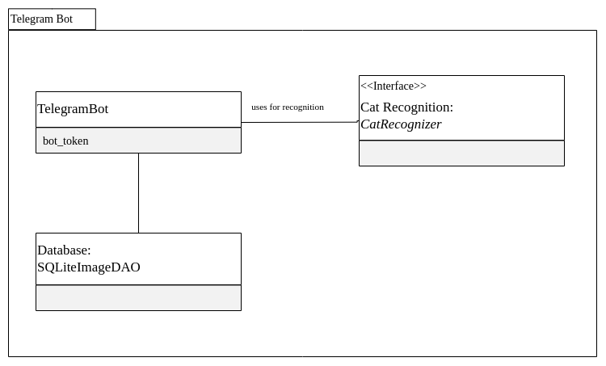
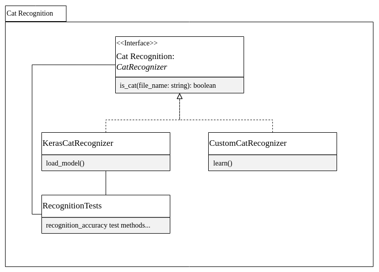
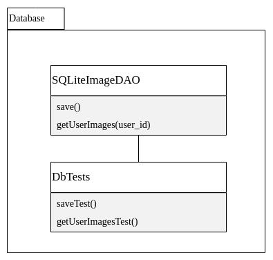
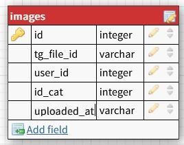

# **[CatOrNot](https://t.me/CatOrNotbot)**

**CatOrNot** is a [Telegram](https://telegram.org/) [Bot](https://core.telegram.org/bots) to determine the presence of a cat in the picture using [Artificial Intelligence](https://en.wikipedia.org/wiki/Artificial_intelligence).

# **Where can I find the demo version of the bot?**

We have prepared a [demo bot](https://t.me/CatOrNotbot) in Telegram, you can use it.

# **How to use CatOrNot bot?**

## Step 1.

Start a conversation with the bot.

> ##### You can use our [demo bot](https://t.me/CatOrNotbot)

## Step 2.

Send the [/help](https://t.me/CatOrNotbot) command to the bot and read the instructions

> ##### This step is optional, but we recommend doing it to familiarize yourself with the capabilities of the bot

## Step 3.

Send a photo to the bot and get the answer **'Cat'** if there is a cat in the photo or **'Not a cat'** if there is no cat

## Step 4.

Send the [/statistics](https://t.me/CatOrNotbot) command to the bot and get your personal usage statistics

## Step 5.

Enjoy

# **How to deploy code to your server?**

Follow instructions from [deploy.md](./deploy.md) file

# **About project**

## The project consists of three modules:

- Conversation module
- Neural network module
- Database interaction module

Each of them will be described below

## Conversation module _(Telegram Bot)_

This module is responsible for the end user interaction interface. During the design phase, our team chose to implement the [Telegram](https://telegram.org/) social networking platform, as it already contains a basic graphical user interface, as well as personal data protection mechanisms, due to which personal statistics will be available only to the end user.

**Bot-token** is required for the module to work correctly. Instructions on how to create your own bot in Telegram and get its token are [here](https://core.telegram.org/bots/features#creating-a-new-bot).

This module can accept and respond to end user images, as well as commands from the list below:

- [/start](https://t.me/CatOrNotbot) — show welcome message
- [/statistics](https://t.me/CatOrNotbot) — show statistics
- [/help](https://t.me/CatOrNotbot) — show help message

Below is a schematic diagram of the module:

## Neural network Module

For content identification during design, it was decided to choose the [Tensorflow](https://www.tensorflow.org/) library with [Keras](https://keras.io/about/) learning models. This solution allowed us to significantly reduce the cost of development resources, as well as maintain an acceptable balance between recognition quality and processing speed.

To optimize performance, custom images are compressed to a size of **224x224 pixels** and also **decolorized**. This approach allows you to save resources during the operation of the neural network.

Since the time and computing resources of our team are limited, it was decided to use a ready-made model from the [Keras](https://keras.io/about/) kit called [VGG16](https://www.tensorflow.org/api_docs/python/tf/keras/applications/vgg16/VGG16). For this reason, the originally planned learning method is not implemented in the current version of the project.

Below is a schematic diagram of the module:

## Database interaction module

This module is responsible for saving the results of user interaction with the bot, as well as for issuing personal statistics upon request.

[SQLite 3](https://www.sqlite.org/) was chosen as a working database during the design in favor of ease of implementation.

Below is a schematic diagram of the module:

Table structure:

- id — unique numeric identificator of record in the database
- tg_file_id — unique text identificator of the file
- user_id — identificator of the user in Telegram
- id_cat — if **1** then there is **a cat in the photo**, if **0** then there is **no cat in the photo**
- uploaded_at — timestamp of upload

## Tests

The correctness of the project is controlled by a set of testing tools developed by our team. You can get acquainted with the available tools by going to the **tests** subfolder
